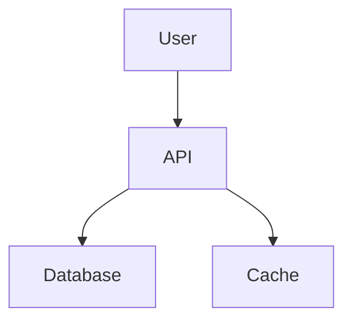

# Documentation

Comprehensive documentation for the Hyperion Fleet Manager platform.

## Structure

```
docs/
├── architecture/      # Architecture documentation
├── runbooks/         # Operational runbooks
└── guides/           # User and developer guides
```

## Architecture

Located in `architecture/`:

- **System Architecture** - High-level system design
- **Infrastructure Architecture** - AWS infrastructure design
- **API Architecture** - API design and patterns
- **Database Schema** - Data models and relationships
- **Security Architecture** - Security controls and practices
- **Network Architecture** - Network topology and configuration
- **Deployment Architecture** - CI/CD and deployment strategy

## Runbooks

Located in `runbooks/`:

Operational procedures for common scenarios:

- **Deployment** - Deployment procedures
- **Rollback** - Rollback procedures
- **Incident Response** - Incident handling
- **Database Operations** - Database management
- **Performance Issues** - Performance troubleshooting
- **Security Incidents** - Security incident response
- **Disaster Recovery** - DR procedures

## Guides

Located in `guides/`:

### Developer Guides

- **Getting Started** - Setup development environment
- **Contributing** - Contribution guidelines
- **API Development** - API development guide
- **Frontend Development** - UI development guide
- **Testing** - Testing strategies and tools
- **Code Style** - Coding standards

### Operations Guides

- **Monitoring** - Monitoring and alerting
- **Logging** - Log management
- **Backup and Recovery** - Backup procedures
- **Scaling** - Scaling operations
- **Security** - Security operations

### User Guides

- **CLI Usage** - Fleet CLI guide
- **Dashboard** - Web dashboard guide
- **API Reference** - API documentation

## Documentation Standards

### Markdown Format

All documentation in Markdown:

- Clear headings
- Code examples
- Tables for structured data
- Links to related docs
- Images for diagrams

### Structure

Each document should include:

```markdown
# Title

## Overview
Brief description of the topic

## Prerequisites
Required knowledge or tools

## Instructions
Step-by-step procedures

## Examples
Concrete examples

## Troubleshooting
Common issues and solutions

## References
Related documentation
```

### Diagrams

Use Mermaid for diagrams:



## Documentation as Code

- Store docs in version control
- Review docs with code reviews
- Auto-generate API docs
- Version documentation
- Keep docs close to code

## Maintenance

### Regular Reviews

- Quarterly documentation review
- Update after major changes
- Deprecate outdated content
- Archive old versions

### Documentation Checklist

Before releasing features:

- [ ] Architecture diagrams updated
- [ ] API documentation updated
- [ ] User guide written
- [ ] Runbook created
- [ ] Examples provided
- [ ] Troubleshooting section added

## Contributing

To contribute documentation:

1. Follow documentation standards
2. Include code examples
3. Add diagrams where helpful
4. Test all commands/code
5. Submit pull request

## Tools

### Documentation Generation

- **Terraform Docs** - Generate Terraform docs
- **Swagger** - Generate API documentation
- **JSDoc** - JavaScript documentation
- **GoDoc** - Go documentation

### Diagram Tools

- **Mermaid** - Markdown diagrams
- **Draw.io** - Architecture diagrams
- **PlantUML** - UML diagrams
- **Lucidchart** - Flowcharts

### Documentation Hosting

- **GitHub Pages** - Static site hosting
- **MkDocs** - Documentation site generator
- **Docusaurus** - Documentation framework

## Best Practices

- Write for your audience
- Use clear, simple language
- Provide working examples
- Include troubleshooting
- Keep documentation current
- Use consistent formatting
- Add visual aids
- Link to related content
- Version documentation
- Make docs searchable

## Templates

### Runbook Template

```markdown
# Runbook: [Procedure Name]

## Overview
Description of the procedure

## When to Use
Situations requiring this procedure

## Prerequisites
- Required access
- Required tools
- Required knowledge

## Procedure
1. Step-by-step instructions
2. With commands and examples
3. Including expected outputs

## Verification
How to verify success

## Rollback
How to undo changes if needed

## Contacts
- Team: [Contact info]
- Escalation: [Contact info]
```

### Architecture Document Template

```markdown
# [Component] Architecture

## Overview
High-level description

## Requirements
Functional and non-functional requirements

## Design
Detailed design description

## Components
List of components

## Data Flow
How data moves through the system

## Interfaces
External interfaces

## Security
Security considerations

## Performance
Performance characteristics

## Monitoring
What and how to monitor

## Deployment
How to deploy

## Future Considerations
Planned improvements
```

## Documentation Index

Quick links to key documents:

- [Getting Started](guides/getting-started.md)
- [System Architecture](architecture/system-overview.md)
- [API Reference](guides/api-reference.md)
- [Deployment Guide](runbooks/deployment.md)
- [Troubleshooting](runbooks/troubleshooting.md)

## Feedback

Improve documentation by:

- Opening issues for errors
- Submitting corrections
- Requesting clarifications
- Adding examples
- Sharing use cases
